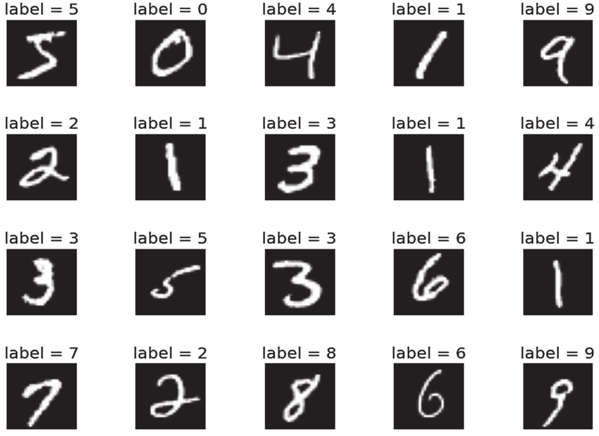
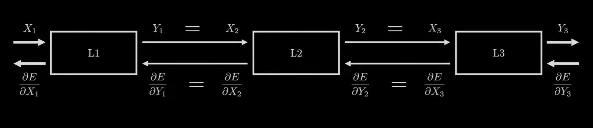

This project involves building a neural network from scratch to classify handwritten digits from the MNIST dataset. The implementation uses only the numpy and pandas libraries for data manipulation and mathematical operations, without relying on high-level frameworks like TensorFlow or PyTorch.

# Introduction
The MNIST dataset consists of 28x28 grayscale images of handwritten digits, with each image labeled from 0 to 9. The goal is to build a neural network that can correctly classify these digits.

Requirements
Python 3.x
Numpy
Pandas
Math (Python standard library)
You can install the required libraries using pip install requirements.txt

# Dataset
The MNIST dataset can be downloaded from [here](https://www.kaggle.com/datasets/oddrationale/mnist-in-csv?resource=download). It includes a training set of 60,000 examples and a test set of 10,000 examples.

# How does This work ?

## 1 - Feed Input
Data flows from layer to layer. retrieve output.
y = network(x, w)

## 2 - Calculate the error
compare output of neural network with the desired output.

## 3 - Adjust parameters
use gradient descent to change parameters to be better for future.

## 4 - Start Again.
Repeat this process training the model.

# Layered Structure

# Steps to Build the Neural Network

### Step 1: Import Libraries
Begin by importing the necessary libraries

### Step 2: Load and Preprocess the Data
Load the MNIST dataset and preprocess it by normalizing the pixel values and converting labels to one-hot encoding:

### Step 3: Initialize Network Parameters
Initialize the weights and biases for the neural network

### Step 4: Define Activation Functions
Define the sigmoid, tanh and softmax activation functions and their derivatives:

### Step 5: Forward Propagation

### Step 6: Compute Loss
Calculate the cross-entropy loss:

### Step 7: Backward Propagation
Implement backward propagation:

### Step 8: Update Parameters
Update the parameters using gradient descent:

### Step 9: Train the Model
Train the neural network by iterating through multiple epochs:

### Step 10: Evaluate the Model
Evaluate the trained model on the test set:

# Conclusion
This project demonstrates how to build a simple neural network from scratch using basic Python libraries. By understanding and implementing each step manually, you gain deeper insights into the workings of neural networks.